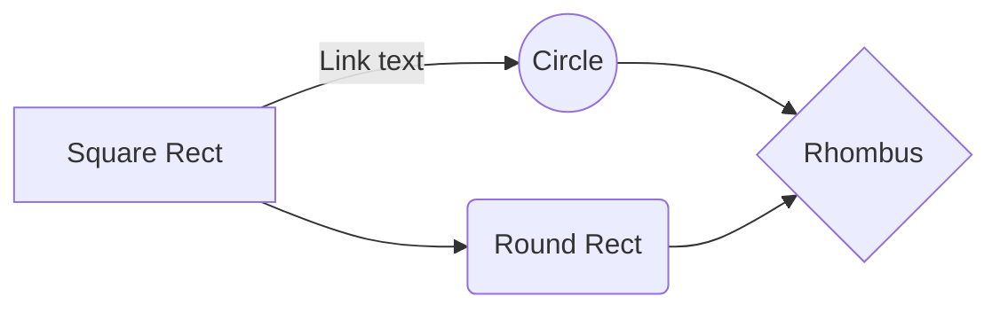

# Rebel Sunshine API

Hi! This is the  **Rebel Sunshine** API. It is built with Ruby on Rails.

# Getting Started
1. Clone the Repo
2. `bundle install`
3. `rake db:migrate`
4. `rails s`
5. Go to localhost:3000

# API Endpoints
The Rebel Sunshine API is a comprehensive API for managing plant information and sensor data. The endpoints are as follows:

|                |ASCII                          |HTML                         |
|----------------|-------------------------------|-----------------------------|
|Single backticks|`'Isn't this fun?'`            |'Isn't this fun?'            |
|Quotes          |`"Isn't this fun?"`            |"Isn't this fun?"            |
|Dashes          |`-- is en-dash, --- is em-dash`|-- is en-dash, --- is em-dash|

## System Organization

The relationship between plants, pots, shelves, sensors, and sensor data is as follows:

Readme generated with https://stackedit.io
